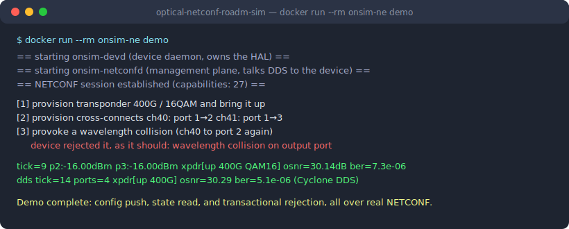
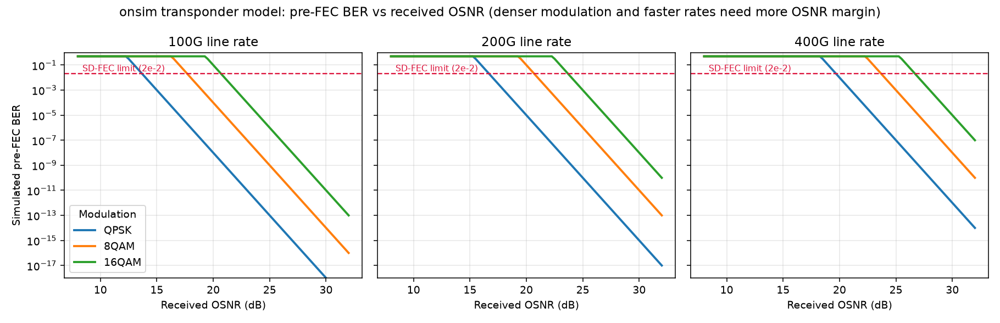

# optical-netconf-roadm-sim

[](https://github.com/yanyana117/optical-netconf-roadm-sim/actions/workflows/ci.yml)

A **simulated optical network element** (ROADM + coherent transponder) with the
management stack used on real carrier-grade optical platforms: a C/C++ hardware
abstraction layer, a model-driven management plane (YANG / NETCONF via
sysrepo + Netopeer2), and Protocol Buffers telemetry over **DDS (Cyclone DDS)**
and ZeroMQ pub/sub.

> Status: **complete (M1–M6)** — a multi-component network element running in
> an ARM Linux container: a real NETCONF client provisions the device through
> Netopeer2 + sysrepo, the management plane and device daemon exchange
> commands and telemetry over a DDS bus (Cyclone DDS), and Protocol Buffers
> telemetry streams to C++ and Python subscribers.



**At a glance**

- Carrier-grade management patterns, end to end: model-driven configuration
  (YANG / NETCONF), transactional rejection of invalid provisioning, and a
  multi-process architecture where the management plane and the device daemon
  exchange commands and telemetry over a DDS bus.
- Engineering hygiene throughout: 18 unit tests, an 85% line-coverage gate,
  cppcheck, valgrind, and a CI job that builds the full container and
  smoke-runs the NETCONF + DDS demo on every push.
- Measured, not just built: BER-vs-OSNR characterization of the device model
  and a full-stack configuration-latency benchmark (see
  [Experiments](#experiments)).

## Why

Optical transport software lives at the intersection of hardware behavior
(wavelengths, power budgets, FEC limits) and network management protocols
(YANG models, NETCONF, telemetry). This project rebuilds that whole vertical
slice in miniature, honestly labeled as a simulation, to demonstrate the
engineering patterns end to end:

```
        NETCONF client (ncclient / any controller)
                        │ XML / NETCONF
        ┌───────────────▼────────────────┐
        │ Netopeer2 + sysrepo (YANG)     │
        │ onsim-netconfd: management     │  reconciles config transactions
        │ plane process                  │  into DDS commands; serves state
        └───────┬───────────▲────────────┘  from the telemetry cache
   DDS control  │           │ DDS telemetry (protobuf payloads)
   req/reply    ▼           │
        ┌───────────────────┴────────────┐
        │ onsim-devd: device daemon      │  sole owner of the hardware
        │   C HAL → C++ device core      │  (simulated ROADM + transponder)
        └───────────────┬────────────────┘
                        │ protobuf telemetry
        DDS (Cyclone) + ZeroMQ pub/sub → C++/Python subscribers
```

## What is modeled (M1)

**ROADM (`onsim::RoadmDevice`)** — N line ports on the ITU-T G.694.1 50 GHz
C-band grid (96 channels):
- wavelength cross-connects with real ROADM semantics: a channel may appear at
  most once per output port (wavelength-collision rule) and once per input port
- output power = input power − insertion loss; ports below the LOS threshold
  raise a loss-of-signal alarm
- deterministic per-tick power drift (seeded PRNG) so runs are reproducible

**Coherent transponder (`onsim::Transponder`)** — 100G/200G/400G line rates,
QPSK/8QAM/16QAM modulation:
- required OSNR grows with modulation density and symbol rate
- pre-FEC BER computed from the OSNR margin; crossing the SD-FEC ceiling
  (2e-2) raises a BER-degrade alarm
- carrier-grade rule enforced: rate/modulation changes are rejected while the
  port is admin-up

**HAL (`include/onsim/hal.h`)** — a C API in the style of vendor hardware SDKs
(opaque handles, integer status codes) so the management plane never touches
C++ types. This is the seam where the NETCONF plugin (M2) attaches.

## Build and test

```bash
cmake -B build
cmake --build build -j
ctest --test-dir build --output-on-failure
```

CI (GitHub Actions) runs the unit tests plus `gcovr` line coverage (fail under
85%), `cppcheck` static analysis, and a `valgrind` leak check on every push.

## Roadmap

| Milestone | Content | Status |
|---|---|---|
| M1 | C++ device core, HAL, GoogleTest suite, CMake, CI (coverage/cppcheck/valgrind) | ✅ |
| M2 | YANG module; sysrepo + Netopeer2 NETCONF server; `onsim-netconfd` reconciliation daemon; end-to-end ncclient demo in an ARM Linux container | ✅ |
| M3 | Protocol Buffers telemetry schema; ZeroMQ pub/sub publisher in the daemon tick loop + Python subscriber CLI | ✅ |
| M4 | Demo transcript + debugging notes in `docs/`; CI builds the image and smoke-runs the demo | ✅ |
| M5 | DDS transport (Eclipse Cyclone DDS): protobuf payloads on topic `onsim_telemetry`, C++ subscriber (`onsim-dds-sub`) | ✅ |
| M6 | Multi-component split: `onsim-devd` (device daemon, owns the HAL) and `onsim-netconfd` (management plane) exchange provisioning commands (DDS request/reply) and telemetry over the NE-internal DDS bus; a device NACK or a dead device daemon fails the NETCONF transaction cleanly | ✅ |

## Try the NETCONF demo (Docker)

```bash
docker build -t onsim-ne -f docker/Dockerfile .
docker run --rm onsim-ne demo    # or: shell / serve
```

The demo provisions a 400G/16QAM transponder and two wavelength
cross-connects over real NETCONF, reads operational state (note output
power = input power minus the 6 dB insertion loss), then tries to provision
a colliding wavelength and shows the device rejecting the whole transaction:

```
[3] provoke a wavelength collision (ch40 to port 2 again)
    device rejected it, as it should: cross-connect 'clash':
    wavelength collision on output port
```

The demo ends with the telemetry stream (protobuf over ZeroMQ pub/sub,
topic `telemetry`, port 5556):

```
tick=9  p1:-60.00dBm p2:-16.00dBm p3:-16.00dBm p4:-60.00dBm  \
        xpdr[up 400G QAM16] osnr=30.14dB ber=7.31e-06
```

Design note: `onsim-netconfd` applies configuration by declarative
reconciliation. On every transaction (SR_EV_CHANGE) it reads the candidate
config and pushes it to `onsim-devd` as DDS request/reply commands; a device
NACK, or an unreachable device daemon, fails the transaction so the datastore
never diverges from hardware, and SR_EV_ABORT reconciles back. Operational
reads are served from the DDS telemetry cache, and rate/modulation changes
are sequenced through admin-down automatically, the way real NE management
planes do.

## Experiments

**1. Transponder model characterization.** `onsim-ber-sweep` sweeps received
OSNR across every modulation x line-rate configuration and records the
model's pre-FEC BER ([CSV](docs/experiments/ber_vs_osnr.csv)); denser
modulation and faster rates shift the curves right, and the SD-FEC crossing
is where the device raises its BER-degrade alarm:



```bash
cmake -B build && cmake --build build --target onsim-ber-sweep
./build/onsim-ber-sweep | python3 tools/plot_ber_sweep.py ber_vs_osnr.png
```

**2. Configuration-transaction latency.** `docker run --rm onsim-ne bench`
times 60 NETCONF `<edit-config>` transactions, each doing real provisioning
work through the whole stack (ncclient, Netopeer2, sysrepo, onsim-netconfd,
DDS request/reply, onsim-devd, HAL). On an ARM Linux container (2 vCPU):

| metric | latency |
|---|---|
| mean | 222.9 ms |
| p50 | 222.0 ms |
| p95 | 244.6 ms |
| max | 250.7 ms |

The DDS request/reply client polls at 10 ms granularity, so a slice of this
budget is the poll interval rather than transport time; the rest is the SSH
and NETCONF/sysrepo transaction machinery.

## Notes

- [docs/debugging-notes.md](docs/debugging-notes.md): real root-cause write-ups
  from building this (version-matrix pinning, ncclient namespaces, a test that
  was wrong instead of the code).
- [docs/demo-transcript.txt](docs/demo-transcript.txt): full captured output of
  `docker run --rm onsim-ne demo`.

## Honest scope

This is a simulation built for learning and demonstration. It does not talk to
real optical hardware, and the physics (insertion loss, OSNR/BER curves) are
simplified textbook shapes chosen for plausible behavior, not calibrated
device models.
